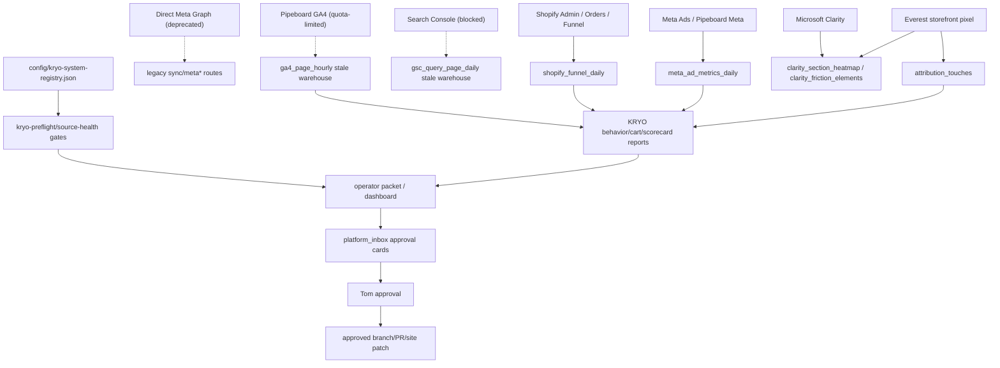

# KRYO Marketing System Audit and High-Leverage Rebuild Plan

Date: 2026-07-25  
Scope: repository, local skills, shared docs, marketing API routes, analytics scripts, Supabase migrations, current health artifacts.  
Safety: no Shopify, Meta, budget, product, theme, ad, or live-page mutation.

## Executive diagnosis

The KRYO marketing system is not missing effort. It is missing one trusted operating spine.

Current state:

- Strong pieces exist: source-health, Shopify readiness, proof gates, first-party attribution pixel, Clarity tables, Meta warehouse, Shopify funnel sync, copy constitution, WhatsApp playbook, creative director, operator packet.
- The system also has too many overlapping routes, scripts, scheduled jobs, historical docs and stale instructions.
- Some old paths still make decisions from `marketing_findings` or trigger direct Meta / old GA4 / GSC sync routes even though those sources are deprecated, quota-limited or blocked.
- `session_warmup` reports BOM/procurement health failures, which has been confused with marketing-data readiness.
- There is not yet a single enforced experiment ledger connecting creative angle, hook, LP version, experiment ID, WhatsApp lead, deposit and purchase.

Target: a small growth operating system:

```text
Reliable data -> primary constraint -> hypothesis -> approved experiment -> implementation PR -> tracking proof -> result -> learning -> next action
```

## Current-state architecture



## Data-flow map

| Source | Ingestion path | Storage | Current status | Main risk |
|---|---|---|---|---|
| Meta Ads | Pipeboard Meta + historical sync script | `meta_ad_metrics_daily`, `meta_ads`, `ad_creatives` | Connected, but no fresh delivery after 2026-07-16 because ads are off | Current CPA/ROAS/winner claims invalid until fresh delivery rows exist |
| Direct Meta Graph | legacy `/api/marketing/sync/meta*` | same | Deprecated, app deleted | False failures if treated as canonical |
| Shopify funnel | `/api/marketing/sync/shopify-funnel` | `shopify_funnel_daily` | Fresh in source-health | Small sample sizes; order attribution still incomplete |
| Storefront events | `theme-assets/snippets/everest-attribution-pixel.liquid` -> `/api/marketing/sync/storefront-event` | `attribution_touches` | Fresh | Event names are inconsistent across old/new Shopify/first-party events |
| Clarity | `/api/marketing/sync/clarity` + section heatmap RPC | `clarity_friction_elements`, `clarity_section_heatmap` | Fresh | Section IDs are theme-specific and need mapping to business sections |
| GA4 | Pipeboard GA4 canonical; old service-account routes | `ga4_page_hourly` | Connector proven, currently quota-limited; warehouse stale through 2026-06-13 | Do not use as current source until quota/backfill fixed |
| GSC | old service-account route | `gsc_query_page_daily` | Blocked/stale through 2026-06-12 | Search/query insights unavailable |
| WhatsApp | click event only today | `attribution_touches.event_type='whatsapp_click'` | Clicks tracked; conversation status not reliably joined | Missing lead qualification/deposit pipeline |
| Deposits | not yet canonical | none found as reliable marketing table | Missing | Cannot prove deposit funnel economics |

## Identifier continuity assessment

| Identifier | Current support | Reliable end-to-end? | Gap |
|---|---:|---:|---|
| Meta campaign ID | Meta warehouse + UTM params | Partial | Must enforce on every ad URL |
| Meta ad set ID | Meta warehouse + UTM params | Partial | Must enforce on every ad URL |
| Meta ad ID | Meta warehouse + UTM params | Partial | Must enforce on every ad URL |
| Creative ID | Meta/ad_creatives partial | No | Not consistently preserved into sessions/leads/orders |
| Creative angle | `ad_creatives.angle`, `utm_angle` | Partial | Needs controlled angle/hook library IDs |
| Hook | some creative docs | No | Missing hook ID in URL/event schema |
| Landing-page version | product handle/path | Partial | Needs canonical LP version ID + experiment ID on page/events |
| Experiment ID | `marketing_experiments`, `landing_pages`, some scripts | Partial | Not enforced across ads, LP, events, orders |
| GA4 session/event | GA4 warehouse | No current | Pipeboard quota + stale warehouse |
| WhatsApp enquiry | click event | No | Need conversation ID/status table or manual import |
| Qualified lead | not reliable | No | Need lead-status model |
| Deposit | not reliable | No | Need deposit initiated/completed events/orders |
| Shopify checkout/purchase | Shopify funnel + orders | Partial | Needs attribution join back to first touch/ad/experiment |

Conclusion: there is no fully reliable identifier connecting ad -> creative -> LP version -> WhatsApp/deposit -> purchase today.

## Can the system answer key commercial questions?

| Question | Current answerability | Evidence / missing piece |
|---|---|---|
| Which creative angle produces qualified enquiries? | No | WhatsApp qualification status missing; only clicks tracked |
| Which ads generate clicks but poor-quality traffic? | Historical only | Meta rows stop 2026-07-16; GA4 current blocked |
| Which LP version improves qualified WhatsApp conversations? | No | LP version + experiment ID not reliably joined to conversation status |
| Which website change improved commercial outcomes? | Partial | Change logs exist, but experiment ledger/result rule is incomplete |
| Which experiments are running? | Partial | `marketing_experiments` exists; no founder-facing canonical ledger yet |
| Which objection limits conversion? | Partial | Clarity/touches suggest trust/cart/checkout; WhatsApp reasons not structured |
| Which recommendations are evidence-backed? | Partial | Source-health/recommendation gate now helps; old scripts still bypass it |
| Which creative concepts are fatigued? | No current | Ads are off; current delivery missing |
| Which funnel stage is primary constraint? | Partial | Strong indication: product interest -> cart/checkout/trust gap; exact lead economics missing |
| Is tracking healthy enough to decide? | Source-dependent | Yes for Clarity/Shopify/touches; no for GA4/GSC/current Meta |

## Existing components worth preserving

- `scripts/kryo-source-health.mjs` and `scripts/kryo-preflight.mjs`: canonical data-readiness gates.
- `scripts/kryo-shopify-readiness.mjs`: read-only website operations preflight.
- `scripts/kryo-recommendation-gate.mjs`: blocks stale current claims.
- `scripts/kryo-operator-action-packet.mjs`: converts evidence packets into ranked actions.
- `theme-assets/snippets/everest-attribution-pixel.liquid`: first-party event spine.
- `src/lib/marketing/kryo-behavior-report.ts` and `kryo-cart-abandon-report.ts`: useful behavior reports.
- `src/lib/marketing/kryo-clean-scorecard.ts`: useful but must be gated by source-health.
- `docs/KRYO_COPY_CONSTITUTION.md`: strong copy/claims guardrail.
- `docs/KRYO_WHATSAPP_PLAYBOOK.md`: strong manual sales playbook.
- `config/kryo-system-registry.json`: canonical/quarantine map.

## Broken, duplicated or dangerous components

| Component | Problem | Recommended action |
|---|---|---|
| `/api/marketing/ops/run-analytics-cycle` cold lane | Calls quarantined direct Meta, old GA4, and GSC sync routes | Guard behind explicit env flag; default to safe syncs only |
| `marketing_findings` consumers | Can generate current-seeming recommendations from stale derived rows | Keep as historical only unless source-health proves freshness |
| Direct Meta env/path | App deleted; should not fail KRYO if Pipeboard works | Deprecated fallback only |
| GA4 service-account sync routes | 403/stale; Pipeboard GA4 canonical but quota-limited | Manual-only until fixed |
| `session_warmup` health | BOM failures confused with marketing health | Root instructions need marketing caveat |
| Many proposal/executor routes | Can create action without source-health gate | Quarantine until guarded |
| Creative director scripts | Read `marketing_findings` and produce packages | Must consume source-health + angle ledger before strategy claims |
| No canonical experiment ledger | Experiment state spread across DB/docs/inbox | Add repo ledger template + decision rules; later DB-backed sync |
| WhatsApp/deposit tracking | Clicks exist; lead/deposit statuses missing | Add event taxonomy and lead/deposit schema plan |

## Recommended target architecture

Use five roles, but implement most behavior as skills/commands first.

1. KRYO Growth Operator
   - Reads source-health, current experiment, operator packet.
   - Presents one constraint and one action.
   - Creates issues/briefs/PR plans only.

2. Measurement Analyst
   - Read-only.
   - Owns source-health, metric definitions, 45-day evidence packs, anomaly checks.
   - Separates observation, interpretation, hypothesis, recommendation.

3. CRO Builder
   - Implements only approved experiments.
   - Branch/PR, screenshots, tracking proof, rollback.
   - Does not invent strategy.

4. Creative Strategist
   - Uses approved customer belief, angle, hook, offer, evidence and CTA.
   - Outputs structured briefs, not disconnected ad/image spam.

5. Experiment and Release Reviewer
   - Checks variable isolation, claims, event integrity, screenshots, rollback.
   - Approves/rejects/revises before Tom approval.

## Agent/skill inventory summary

| Asset | Current role | Keep/change |
|---|---|---|
| `everest-marketing` Codex skill | Marketing entrypoint | Keep; updated to source-health first |
| Claude clone/launch commands | Reference implementations | Keep as examples, not autonomous paths |
| `clone-ad-qc`, `clone-product-qc` | QC subagents | Keep; fold into release-review skill later |
| KRYO writer agents | Generate page copy sections | Keep only behind Creative Strategist brief + copy gate |
| `source-command-launch-kryo-v2` | Launches KRYO variants | Quarantine for now; too powerful without measurement spine |
| `promo-storyboard`, `i2v` | Creative asset production | Keep as production tools after brief approval |
| `kryo-creative-director.mjs` | Strategy package generator | Modify to require source-health and angle IDs |

## Ten highest-leverage changes

Scoring: impact × confidence × speed to learning ÷ effort ÷ risk.

| Rank | Change | Problem | Expected impact | Confidence | Effort | Risk | Success metric |
|---:|---|---|---|---:|---:|---:|---|
| 1 | Guard analytics cycle from quarantined sync routes | Old cold lane triggers broken/direct sources | Fewer false failures, cleaner health | High | Low | Low | `run-analytics-cycle` no longer calls legacy routes by default |
| 2 | Canonical event taxonomy + metric definitions | Teams debate numbers | High | High | Low | Low | Every report names event/source/freshness |
| 3 | Experiment ledger + decision rules | No single current experiment truth | High | High | Low | Low | Each experiment has ID, metric, threshold, result |
| 4 | WhatsApp/deposit tracking model | Cannot connect interest to revenue | Very high | Medium | Medium | Medium | Lead/deposit events join to experiment/ad/LP |
| 5 | GA4 Pipeboard backfill or quota upgrade | GA4 current data unavailable | Medium | Medium | Medium | Low | GA4 fresh <48h |
| 6 | GSC connector/access repair | Search insight absent | Medium | Medium | Low external | Low | GSC fresh <48h |
| 7 | Creative angle/hook ID library | Creative not reliably joined to outcomes | High | Medium | Medium | Low | Ads/LP/events carry angle+hook IDs |
| 8 | Source-health gate inside report builders | Old reports can bypass gate | High | High | Medium | Low | Reports refuse current claims when source unusable |
| 9 | Release-review checklist automation | Prevents risky site/ad changes | High | High | Medium | Low | Every PR has experiment ID, screenshot, rollback |
| 10 | Daily founder decision brief | Founder needs one action | High | Medium | Medium | Low | Dashboard shows constraint, active experiment, action, approvals |

## Recommended implementation order

1. Stop unsafe sync/decision paths.
2. Establish metric definitions and attribution rules.
3. Add experiment ledger and decision rules.
4. Add daily decision packet generated from source-health + ledger.
5. Add WhatsApp/deposit lifecycle events and schema.
6. Add angle/hook library.
7. Gate creative director and launch commands behind approved briefs.
8. Build CRO PR template and reviewer checklist.
9. Repair GA4/GSC freshness.
10. Only then scale creative/LP test volume.

## Remaining manual dependencies

- Tom or account owner must resolve Pipeboard quota for GA4.
- Tom/account owner must restore GSC access or provide a connector.
- WhatsApp qualification and deposit statuses need a source: manual CSV, CRM, WhatsApp Business export, or API.
- Website/ad production changes still need Tom approval.

## Immediate safe implementation slice

This audit recommends implementing now:

1. Add `/marketing` source-of-truth scaffold that references existing docs.
2. Add metric definitions and attribution rules.
3. Add experiment ledger template and decision rules.
4. Patch `run-analytics-cycle` so quarantined legacy sync routes require explicit opt-in.

These are repository-only changes and do not mutate live systems.

## Implemented in this slice

Repository-only changes made after the audit:

1. Created `/marketing` source-of-truth scaffold.
2. Added metric definitions, attribution rules and data-quality checks.
3. Added experiment decision rules and ledger template.
4. Added initial angle library and creative brief template.
5. Patched `src/app/api/marketing/ops/run-analytics-cycle/route.ts`:
   - Hot lane skips legacy GA4 sync unless `ALLOW_LEGACY_GA4_SYNC=true`.
   - Cold lane skips quarantined legacy syncs unless `ALLOW_QUARANTINED_MARKETING_SYNCS=true`.
   - Safe cold lane keeps Clarity, Shopify, Shopify funnel, attribution processing and findings refresh.
6. Updated `config/kryo-system-registry.json` to include skipped asset sync routes.

These changes do not deploy, mutate Shopify, alter ads, or change budgets.

## Implemented in continuation slice

Additional repository-only changes:

1. Added proposed measurement-spine migration:
   - `supabase/migrations/20260725050000_kryo_measurement_spine.sql`
   - Tables: `kryo_growth_experiments`, `kryo_leads`, `kryo_deposit_events`.
   - View: `vw_kryo_growth_spine_daily`.
2. Added schema documentation:
   - `marketing/analytics/measurement-spine-schema.md`
3. Added deterministic founder decision brief command:
   - `scripts/kryo-growth-decision-brief.mjs`
   - package script: `npm run operator:kryo-growth-brief`
   - Outputs the current constraint, active experiment, data reliability, one recommended action and pending approvals.
4. Added GitHub control-plane templates:
   - `.github/ISSUE_TEMPLATE/kryo-experiment.yml`
   - `.github/PULL_REQUEST_TEMPLATE/kryo-experiment.md`

These changes still do not apply migrations, deploy code, mutate Shopify, alter ads, or change budgets.
